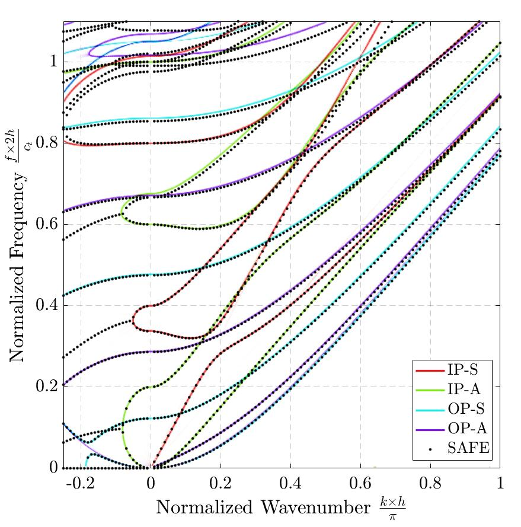

# ribbonwaves
 Ribbon-shaped waveguides: SAFE method, reduced model, experimental identifivation and inverse method

This repository contains the companion scripts for the article *article name*

## How to get started ?
The main MATLAB script [`demo.m`](demo.m) contains a minimum working example.

## An example of $k-\omega$ diagram

 
   

